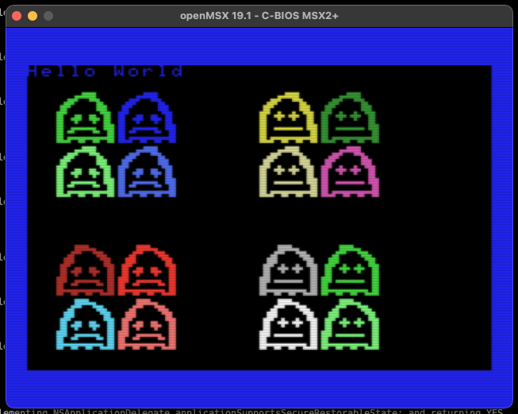

# msx-graphics
Show some tiles and sprites graphics for the MSX computers.

## Information about the MSX
- [MSX Technical Data Book](msx_technical_data_book.pdf)

## Prerequisite
- Install [WLA-HL](https://www.villehelin.com/wla.html) to assemble and link code
- Install an MSX emulator, like [openMSX](https://openmsx.org), to run

For MacOS use Homebrew to install :
```
brew install wla-dx
```

## Build
First assemble with z80 target, then link object as rom image.

```
wla-z80 teedjay.asm
wlalink teedjay.link teedjay.rom
```

## Run using MSX emulator
On MacOS you could open the ROM you just built manually from the menu of the emulator, or from command line.
```
open teedjay.rom
```

## What does it look like?

